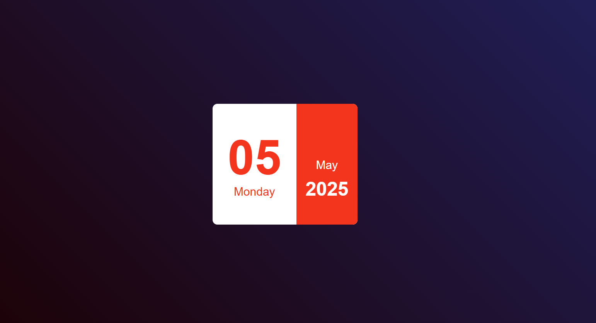

# 📅 Calendar App

A simple and responsive calendar built using **HTML**, **CSS**, and **JavaScript**. This project demonstrates how to create an interactive calendar that displays the current month, highlights the current day, and year.

## 🚀 Features

- Displays the current day,month and year
- Highlights today's date
- Lightweight and dependency-free

## 🖼️ UI

## Live Demo

> [🌐CHECK today date ]()

## 🛠️ Technologies Used

- **HTML5** – For the structure
- **CSS3** – For styling and layout
- **JavaScript** – For logic and interactivity
